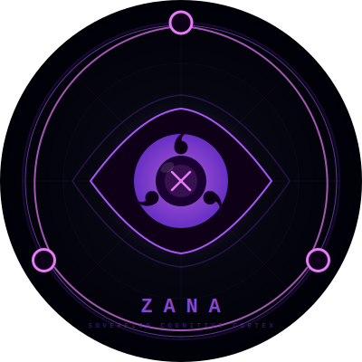

<div align="center">



# ZANA Core

**Every person in the world can have their own Aeon.**

*Your memories. Your evolution. Your rules. Running on your hardware.*

---

[](https://github.com/Kemquiros/zana-core)
[](LICENSE)
[](https://github.com/Kemquiros/zana-core)
[](#zfi--zana-fitness-index)
[](docs/paper/zana_paper.pdf)
[](#quick-start)

</div>

---

## What is ZANA?

The current AI paradigm concentrates intelligence in a handful of corporations that accumulate unlimited data about every user, control the models that "think for you," and define what you remember, how you evolve, who you are digitally.

ZANA inverts this with a single architectural principle:

```
┌─────────────────────────────────────────────────┐
│  YOUR AEON  (lives on your hardware)            │
│  Memory (4 stores) · Identity · Mastery Map     │
│  Civic Ledger · DNA · WisdomRules               │
└──────────────────────┬──────────────────────────┘
                       │  Z-Protocol (open, free)
                       ↓
┌─────────────────────────────────────────────────┐
│  PROCESSING  (interchangeable — your choice)    │
│  Ollama · Claude · Gemini · GPT-4o · Mistral    │
│  Groq · DeepSeek · LLaMA · Gemma · any model   │
└─────────────────────────────────────────────────┘
```

**Your Aeon is your digital soul. The model is the compute engine.  
No one should own your soul.**

---

## Quick Start

**Linux / macOS**
```bash
bash <(curl -LsSf https://zana.vecanova.com/install.sh)
```

**Windows (WSL 2)**
```powershell
# Step 1 — PowerShell (Admin)
wsl --install
```
```bash
# Step 2 — Ubuntu terminal
bash <(curl -LsSf https://zana.vecanova.com/install.sh)
```

Then run `zana start` and open **http://localhost** in your browser.

> **Guides:** [Linux](docs/INSTALL_LINUX.md) · [macOS](docs/INSTALL_MACOS.md) · [Windows/WSL](docs/INSTALL_WSL.md) · [User Manual](docs/USER_MANUAL.md)

---

## Your Aeon

An Aeon is not a chatbot. It is a sovereign cognitive entity that:

- **Remembers** — every conversation, document, and decision you've ever had with it
- **Reasons** — step by step, symbolically, not just word by word
- **Evolves** — its skills improve the more you use it, while you sleep
- **Protects** — your data never leaves your hardware unless you explicitly choose it
- **Learns collectively** — shares improvements with other Aeons without sharing your data

| What your Aeon does | What it means for you |
|---|---|
| 🧠 **Persistent Memory** | Every idea, note, and conversation — indexed and searchable in under 50ms |
| ⚙️ **Code Agent** | Describe what you want. ZANA plans, writes, and tests while you do something else |
| 📊 **Business Intelligence** | Ask questions across your contracts, KPIs, and reports — connected |
| 🔬 **Research** | Drop papers or links. ZANA maps connections and surfaces what matters |
| 🛡️ **Private by design** | No telemetry. No accounts. No data sent anywhere without your permission |
| 🌱 **Self-improving** | Skills evolve automatically. The Aeon sharpens every day |
| 🎓 **Adaptive tutor** | Remembers what confused you and adjusts how it explains things |
| 🌐 **Model-agnostic** | Swap your LLM with one environment variable — the Aeon stays |

---

## Aeon Evolution — Mastery Map

Your Aeon grows as you grow. Every interaction advances its understanding of your path.

```
Seed          First interaction — the Aeon awakens
  ↓
Larva         Patterns emerge — basic skills learned
  ↓
Warrior       Tactical autonomy — proactive assistance  ← current default
  ↓
Champion      Real proactivity — anticipates before you ask
  ↓
Legend        Mastery — contributes skills to the global Agora
  ↓
Singularity   Full user-Aeon cognitive fusion
```

The rank reflects genuine accumulated wisdom — not a progress bar.

---

## Architecture — Five Pillars

| Pillar | Module | What it does |
|---|---|---|
| ⚔️ **Sentinel** | `armor/` (Rust) | Blocks PII and prompt injection at **2.1 µs/request** |
| 📚 **Archivist** | `episodic/`, `rust_core/`, `world_model/`, `procedural_memory/` | Four memory stores: Semantic (ChromaDB), Episodic (PostgreSQL + pgvector), World Model (Neo4j), Procedural Skills (JSON + Q-Learning) |
| 📊 **Analyst** | `reasoning_engine/` (Rust), `swarm/` | Exact Math Logic (EML) — symbolic reasoning that never hallucinates numbers |
| ⚙️ **Operator** | `orchestrator/graph.py`, `mcp/` | LangGraph pipeline: Orchestrator → Planner → Executor → Critic → Compressor → Chronicler |
| 📣 **Herald** | `sensory/` (FastAPI), `aria-ui/` (Next.js), `telegram_bot/` | Voice, vision, text, WebSocket — multilingual |

### The Steel Core (Rust)

Three compiled `.so` binaries handle performance-critical work:

| Binary | What it does | Latency |
|---|---|---|
| `zana_steel_core.so` | Kalman filter, Policy Brain (RL), EML operator | 1.4–18 µs |
| `zana_armor.so` | PII detection + prompt injection guard | 2.1 µs |
| `zana_audio_dsp.so` | Voice activity detection, Whisper preprocessing | real-time |

All three compile automatically on first `zana start`. Rust installs itself if missing.

### Infrastructure

| Service | Port | Role |
|---|---|---|
| Sensory Gateway (FastAPI) | 54446 | Main API entry |
| ARIA UI (PWA) | 54448 | Web interface |
| PostgreSQL + pgvector | 55433 | Episodic memory |
| Redis | 56380 | Session cache |
| Neo4j | 57474 | World model graph |
| Caddy | 80 / 443 | Reverse proxy + TLS |

---

## The Z-Protocol Stack

Open protocols — free to implement, extend, and fork:

| Protocol | Purpose | Status |
|---|---|---|
| **Z-Sovereign** | Sentinel + Civic Ledger — what your Aeon protects | ✅ Live |
| **Z-Identity** | DNA + Mastery Map — who your Aeon is | ✅ Live |
| **Z-Memory** | 4-store memory architecture | ✅ Live |
| **Z-Think** | Orchestrator + Symbolic Reasoning (EML) | ✅ Live |
| **Z-Express** | Herald — multimodal, multilingual | ✅ Live |
| **Z-Civic** | Immutable SHA-256 reasoning audit | ✅ Live |
| **Z-Skill** | Open skill format (agentskills.io compatible + extensions) | 🔄 v3.0 |
| **Z-Sync** | Privacy-preserving WisdomRule federation | 🔄 v3.5 |
| **Z-DNA** | Portable Aeon serialization (`.zaeon.enc`) | 🔄 v3.5 |
| `zaeon://` | Universal Aeon identity URI | 🔄 v3.5 |

---

## Model Providers

ZANA is model-agnostic. Swap your LLM with one environment variable:

| Provider | Activation |
|---|---|
| Anthropic Claude | `ANTHROPIC_API_KEY=sk-...` |
| OpenAI GPT | `OPENAI_API_KEY=sk-...` |
| Google Gemini | `GOOGLE_API_KEY=AIza...` |
| Groq | `GROQ_API_KEY=gsk_...` |
| Ollama (local, no key) | `OLLAMA_BASE_URL=http://localhost:11434` |
| Gemma 4 (recommended local) | `ZANA_PRIMARY_MODEL=ollama/gemma4` |

Each cognitive module (Curator, Compressor, Orchestrator) can use a different provider independently.

---

## CLI Reference

| Command | What it does |
|---|---|
| `zana start` | Boot the full ZANA stack |
| `zana stop` | Shut everything down |
| `zana status` | Running services and health |
| `zana setup` | Configure API keys or set up local Ollama |
| `zana chat` | Terminal conversation |
| `zana hardware` | Scan hardware and get model recommendations |
| `zana hardware --recommend` | Best models for your exact machine |
| `zana upgrade` | Update to the latest version |
| `zana embed <file>` | Index a document into memory |
| `zana aeon list` | Available Aeon agents |
| `zana aeon use <name>` | Switch active Aeon |

---

## ZFI — ZANA Fitness Index

ZANA scores itself across 7 cognitive pillars on every boot:

| Mode | Score |
|---|---|
| Cold (no Docker) | 89.8 / 100 |
| Hot (full stack) | 100.0 / 100 |

---

## What's New — v2.9

- **Sovereign Inference Wizard** — `zana setup` guides you through Ollama in 3 steps: verify → pick model → live test. Zero config files.
- **Hardware Intelligence** — `zana hardware --recommend` uses llmfit to find the best model for your exact RAM + GPU.
- **Windows / WSL 2** — full Windows support, vault on Windows-side path, Rust auto-installed.
- **Self-healing Upgrade** — `zana upgrade` works without GitHub Releases. Always current from main.
- **Trajectory Capture** — every session saved to `data/trajectories/` in ZANA native + ShareGPT JSONL for future fine-tuning.
- **Skill Lifecycle (Curator)** — skills auto-reviewed every 30 min. Degraded skills improved by Haiku; irrecoverable ones archived.
- **Context Compression** — sessions never slow down. Orchestrator auto-summarizes history before context grows too large.

---

## Roadmap

See [docs/ROADMAP.md](docs/ROADMAP.md) for the full roadmap.

**Next — v3.0 "Zero Friction" (Q3 2026)**

- `zana init` wizard — any person, any hardware, under 3 minutes
- Z-Skill v1.0 — open skill format, agentskills.io compatible
- Auto-WisdomRules — Aeon mines past sessions, proposes skills automatically
- Herald Gateway — Telegram, WhatsApp, Discord
- 12 languages
- Sentinel Event Bus — 8 lifecycle events for policy control

---

## Technical Paper

[**ZANA: A Neuro-Symbolic Personal Cognitive AI Runtime (PDF)**](docs/paper/zana_paper.pdf)

---

## Contribute

ZANA is MIT licensed. The Z-Protocol is open.

- **Skills** — create and publish to The Agora
- **Adapters** — new Herald channels (messaging platforms, devices)
- **Languages** — translate and culturally adapt for your community
- **Providers** — new model adapters for the LiteLLM router
- **Armor** — security audits and Rust contributions

```bash
git clone https://github.com/Kemquiros/zana-core
cd zana-core
zana init
```

---

## Acknowledgements

With gratitude to: `eglejsr`, `ferchus_nandus`, `domination`, `kamo`, `virtus_sapiens`, `oma_fren`, `xanderx_monkey`.

---

<div align="center">

[](https://ko-fi.com/kemquiros)

Built with honor in Medellín, Colombia. 🇨🇴  
**[VECANOVA](https://vecanova.com)** · MIT License

*JUNTOS HACEMOS TEMBLAR LOS CIELOS.*

</div>
